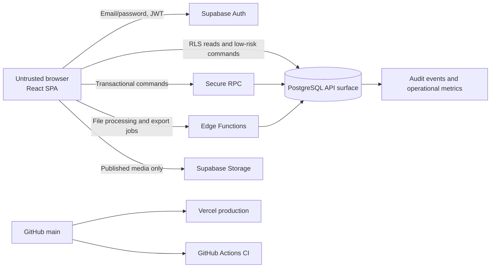

# ColorPlay Platform Foundation Design

## 1. Document control

- Date: 2026-07-13
- Design status: approved for written-spec review
- Implementation status: not authorized
- Canonical project root: `colorplay-react-supabase-docs-v2/`
- Migration strategy: clean rebuild with legacy comparison and verified vertical slices
- Target GitHub repository: public `peiyi-liu/colorplay`, to be created only after the implementation plan is approved
- Frontend deployment: Vercel, with `main` as the production branch

This document defines the architecture and the independently verifiable Phase 1 foundation. It does not authorize application scaffolding, database migrations, GitHub publication, Vercel project creation, or product-feature implementation.

## 2. Normative sources and decision precedence

The design follows this precedence:

1. `acceptance/ACCEPTANCE_CRITERIA.md`
2. `spec/*.md`
3. `AGENTS.md`
4. This approved design's explicit refinements where they resolve ambiguity without lowering acceptance requirements
5. The legacy HTML, used only as a product and visual reference

Normative source set:

- `AGENTS.md`
- `README.md`
- `spec/00-project-charter.md`
- `spec/01-user-roles-and-flows.md`
- `spec/02-system-architecture.md`
- `spec/03-data-model-and-rls.md`
- `spec/04-security-and-privacy.md`
- `spec/05-game-mechanics.md`
- `spec/06-content-and-question-bank.md`
- `spec/07-ui-visual-system.md`
- `spec/08-testing-and-evidence.md`
- `spec/09-nonfunctional-requirements.md`
- `spec/10-migration-roadmap.md`
- `spec/11-reference-standards.md`
- `acceptance/ACCEPTANCE_CRITERIA.md`
- `acceptance/EVIDENCE_TEMPLATE.md`

`DOCUMENT_MANIFEST.json` reports 78 acceptance criteria, while the normative acceptance file contains 84 unique IDs. The difference is the six `AC-A11Y-*` criteria, whose category contains a digit and was evidently excluded by the manifest counter. This design traces all 84 criteria. Phase 1A includes correcting the manifest generator or counting rule and regenerating the package metadata without changing acceptance content.

## 3. Approved product and operational decisions

| Decision | Approved value | Consequence |
|---|---|---|
| Authentication | Supabase Auth Email/password | Students use individual email accounts; no magic-link dependency in MVP |
| Package management | pnpm with one committed `pnpm-lock.yaml` | No `package-lock.json`; local and CI commands remain pnpm-first |
| Vercel build | `npm run build` | Invokes the package `build` script after pnpm dependency installation |
| Vercel output | `dist` | Vite static output only |
| Production branch | `main` | Vercel Git integration deploys `main` to production and other branches/PRs to preview |
| Browser Supabase variables | `VITE_SUPABASE_URL`, `VITE_SUPABASE_ANON_KEY` | Both are validated at startup; the anon key is browser-publishable and protected by RLS |
| Secret policy | No service role, DB password, JWT secret, or server credential in `VITE_*` | Server secrets live only in Supabase or deployment secret stores |
| Leaderboard | Enabled by default; teacher may disable or anonymize | Only display name, Blook, XP, and rank are exposed |
| Retention | Outside Phase 1 | Production research use is blocked until the ethics/consent policy fixes duration and deletion or anonymization behavior |
| Production backup plan | Outside Phase 1 | Production launch is blocked until the selected Supabase plan satisfies RPO <= 24 hours and RTO <= 8 hours |

The environment-variable name differs from the example `VITE_SUPABASE_PUBLISHABLE_KEY` in `spec/02-system-architecture.md`. The approved project contract uses `VITE_SUPABASE_ANON_KEY`; its security classification remains the same browser-publishable low-privilege key. Tests and secret scans enforce behavior rather than relying on the variable name.

## 4. Repository audit baseline

The canonical root currently contains only governance and specification material:

```text
colorplay-react-supabase-docs-v2/
├─ AGENTS.md
├─ README.md
├─ DOCUMENT_MANIFEST.json
├─ acceptance/
├─ docs/superpowers/specs/
├─ scripts/                    # empty
└─ spec/
```

There is no Git repository, package manifest, lockfile, React source, Vite configuration, Supabase project, migration, CI workflow, automated test, or evidence artifact. The original prototype exists one directory above the canonical root as `GAME(1) - 複製 - 複製.html` and must remain untouched.

The legacy prototype demonstrates useful product behavior:

- six chapter entries, with Chapter 3 containing one review topic and two questions;
- review cards, a 20-second quiz, five-second speed bonus, answer feedback, and result summary;
- XP, Token, Level, six Blooks, purchase/equip UI, and leaderboard UI;
- teacher UI, browser-side XLSX import, Kahoot external links, and QR generation.

Its code is not a migration source because it uses global mutable state, direct DOM mutation, inline event handlers, browser-held correct answers, client-side scoring and timing, localStorage wallets and attempts, a hard-coded teacher password, fixed leaderboard records, unsafe HTML composition, and an import parser that defaults invalid correct answers to option A.

After plan approval, Phase 1A copies the legacy file byte-for-byte to `legacy/colorplay-prototype.html`, records its SHA-256, and leaves the outside original unchanged. Reference screenshots are captured from the untouched prototype. The copied file is never included in the production application bundle.

## 5. Migration options and selected strategy

### Option A: clean rebuild with legacy comparison and vertical slices — selected

Create a strict React/Supabase foundation, preserve the prototype as read-only reference, and deliver small end-to-end slices that include UI, trusted backend, authorization, automated tests, and evidence. This has the lowest long-term debt and the clearest fit with solo development and AI-assisted implementation.

### Option B: incremental strangler around the legacy page — rejected

Keeping the legacy page live while replacing parts would preserve early demos, but it would also create dual routing, state, styling, authentication, and persistence. The unsafe client authority would remain reachable during migration, making acceptance scope ambiguous and encouraging temporary adapters that become permanent.

### Option C: separate full backend and frontend phases — rejected as the primary strategy

Building all database/RPC work before UI would delay usability and browser evidence; building UI first would require mock or temporary client authority. Small backend-first steps remain valid inside each vertical slice, but integration is verified before the slice is considered complete.

## 6. System context and trust boundary



The browser, DOM, React state, URL, timers, localStorage, sessionStorage, IndexedDB, network payloads, and user-controlled clocks are untrusted. Supabase Auth identifies a caller but does not independently authorize resources. PostgreSQL constraints, RLS, grants, and transaction functions are the authorization and integrity boundary.

The browser never decides or directly writes correct answers, final score, XP, Token, wallet balance, ownership, leaderboard facts, teacher role, classroom access, export permission, or audit records.

## 7. Independently testable subsystems

| Subsystem | Responsibility | Inputs -> outputs | Dependencies | Trust boundary | Primary specs | Acceptance IDs |
|---|---|---|---|---|---|---|
| React application shell | Providers, router, layouts, boundaries, navigation, runtime configuration | URL/session/config -> rendered route state | Router, Query, Auth bootstrap | Browser only; no authority | 01, 02, 07, 09 | AC-ENV-001, AC-AUTH-001, AC-LEARN-004, AC-UI-003, AC-UI-006, AC-UI-007 |
| Authentication | Email/password sign-in, sign-out, session restore, intended-route recovery | Credentials/Auth events -> session state | Supabase Auth, profiles | Auth proves identity; DB authorizes | 01, 03, 04 | AC-AUTH-001 to AC-AUTH-003, AC-AUTH-005 |
| User profile and roles | Safe profile fields, role bootstrap, active Blook, timezone | Auth user/admin assignment -> profile projection | Auth, economy | User cannot assign role | 01, 03, 04, 05 | AC-AUTH-003 to AC-AUTH-005, AC-GAME-001, AC-SEC-001, AC-SEC-003 |
| Class and membership | Class ownership, invites, join, membership status | Join code/teacher command -> membership | Auth, audit | Membership checked in DB on every access | 01, 03, 04 | AC-AUTH-006, AC-AUTH-007 |
| Curriculum hierarchy | Course, chapter, section, subtopic, publish state, ordering | Teacher content -> published student projection | Profile, membership | Draft data never reaches student | 00, 01, 03, 06 | AC-LEARN-001, AC-LEARN-002, AC-LEARN-004, AC-TCH-002 |
| Review cards and media | Versioned learning cards, accessible media | Published content/media -> review UI | Curriculum, Storage | Signed/published media policy | 01, 03, 06, 07 | AC-LEARN-001, AC-LEARN-003, AC-TCH-008 |
| Question bank | Versioned prompts/options/answer keys and publication validation | Teacher authoring -> immutable published version | Curriculum, audit | Answer key inaccessible to student API | 03, 04, 06 | AC-QUIZ-002, AC-QUIZ-008, AC-TCH-002, AC-TCH-005, AC-TCH-008 |
| Quiz session | Authoritative question selection, frozen order, deadlines, recovery | Scope/request ID -> session/public question | Membership, question bank | Server selects and timestamps | 01, 02, 03, 05 | AC-QUIZ-001, AC-QUIZ-006, AC-QUIZ-009, AC-QUIZ-012 |
| Answer submission | Ownership/option/deadline validation and authoritative marking | Session question/option/idempotency key -> public result | Quiz, private answer key | Transaction function owns correctness | 02, 03, 04, 05 | AC-QUIZ-002 to AC-QUIZ-009, AC-SEC-004, AC-SEC-005 |
| Score, XP, and Token economy | Final totals, reward decay, immutable ledgers, wallet reconciliation | Finalized answers/rule version -> score and ledger | Quiz, classroom, audit | Finalize transaction is sole reward writer | 03, 05, 09 | AC-QUIZ-010, AC-QUIZ-012, AC-GAME-001 to AC-GAME-003, AC-REL-001, AC-REL-003 |
| Blook inventory and shop | Catalog, atomic purchase, ownership, equip | Blook/idempotency key -> wallet/ownership | Economy, profile | Secure transaction locks wallet | 01, 03, 05 | AC-GAME-004 to AC-GAME-007, AC-REL-001 |
| Leaderboard | Classroom-scoped rank and privacy projection | Classroom/ranking setting -> Top 10 and own rank | Economy, membership, profile | Only safe projection is exposed | 01, 03, 05 | AC-GAME-008, AC-GAME-009, AC-AUTH-006 |
| Teacher dashboard | Authorized aggregate diagnostics with explicit denominators | Filters -> aggregates/empty/error state | Membership, quiz, curriculum | No cross-class raw access | 01, 03, 07 | AC-TCH-001, AC-TCH-009, AC-AUTH-005, AC-AUTH-006 |
| Question import | Template, upload, constrained parse, validation, preview, atomic commit | XLSX/idempotency key -> report/content versions | Storage, curriculum, Edge Function | Untrusted file parsed under limits | 04, 06, 07 | AC-TCH-003 to AC-TCH-008, AC-REL-001 |
| Research export | Authorized pseudonymous dataset and audit trail | Filters/export request -> versioned CSV/XLSX | Membership, quiz, audit | Edge Function rechecks classroom ownership | 00, 01, 03, 04 | AC-TCH-010, AC-AUTH-006, AC-DOC-003 |
| Security and RLS | Default-deny grants, policies, secure functions, abuse limits | JWT/resource relationship -> allow/deny | All data domains | PostgreSQL is enforcement point | 02, 03, 04 | AC-ENV-004, AC-AUTH-004 to AC-AUTH-007, AC-SEC-001 to AC-SEC-007 |
| Testing and evidence pipeline | Automated quality gates and reproducible browser/DB evidence | Commit/build/seed -> reports and manifest | All subsystems | No mock application API in acceptance | 08, 09 | AC-ENV-001 to AC-ENV-004, AC-UI-001 to AC-UI-015, AC-A11Y-001 to AC-A11Y-006, AC-DOC-001 to AC-DOC-003 |
| Deployment and observability | CI, Vercel deploys, SPA fallback, health, logs, alerts | Git commit/environment -> deployment/telemetry | GitHub, Vercel, Supabase | Secrets remain in platform stores | 02, 04, 08, 09 | AC-ENV-003, AC-SEC-006, AC-PERF-001 to AC-PERF-003, AC-COMPAT-001, AC-REL-002, AC-UI-007 |

## 8. Target repository structure

```text
colorplay-react-supabase-docs-v2/
├─ .github/workflows/
│  ├─ ci.yml
│  └─ acceptance.yml
├─ acceptance/
├─ artifacts/acceptance/
├─ docs/
│  ├─ adr/
│  └─ superpowers/
│     ├─ specs/
│     └─ plans/
├─ legacy/
│  ├─ colorplay-prototype.html
│  └─ README.md
├─ public/
├─ scripts/
│  ├─ acceptance/
│  └─ verify/
├─ src/
│  ├─ app/
│  │  ├─ boundaries/
│  │  ├─ providers/
│  │  ├─ router/
│  │  └─ shell/
│  ├─ components/
│  ├─ features/
│  │  ├─ auth/
│  │  ├─ profile/
│  │  ├─ classrooms/
│  │  ├─ curriculum/
│  │  ├─ review/
│  │  ├─ questions/
│  │  ├─ quiz/
│  │  ├─ economy/
│  │  ├─ blooks/
│  │  ├─ leaderboard/
│  │  └─ teacher/
│  ├─ lib/
│  │  ├─ config/
│  │  ├─ observability/
│  │  ├─ query/
│  │  └─ supabase/
│  ├─ styles/
│  └─ types/
├─ supabase/
│  ├─ functions/
│  │  ├─ validate-question-import/
│  │  ├─ commit-question-import/
│  │  └─ export-research-dataset/
│  ├─ migrations/
│  ├─ tests/
│  └─ seed.sql
├─ tests/
│  ├─ acceptance/
│  ├─ e2e/
│  ├─ fixtures/
│  ├─ integration/
│  └─ visual/
├─ .env.example
├─ eslint.config.js
├─ package.json
├─ playwright.config.ts
├─ pnpm-lock.yaml
├─ tsconfig.json
├─ vercel.json
├─ vite.config.ts
└─ vitest.config.ts
```

Feature modules may import shared UI and `lib` contracts but not another feature's internals. Public entry points expose a narrow API. Server data lives in TanStack Query; Zustand is permitted only for transient quiz presentation. Formal progress, rewards, and results never live solely in client storage.

## 9. Route design

```text
/
/login
/join
/unauthorized
/app
/app/chapters/:chapterId
/app/chapters/:chapterId/topics/:topicId/review
/app/quiz/:sessionId
/app/quiz/:sessionId/result
/app/profile
/app/shop
/app/leaderboard
/teacher
/teacher/classes/:classroomId
/teacher/content
/teacher/content/imports/:importId
/teacher/analytics/:classroomId
/teacher/exports
```

`/` resolves from authenticated role and membership state. `/app/*` requires an authenticated student or teacher. `/teacher/*` requires a teacher role for navigation and a database ownership/membership check for every query. Guards improve UX but do not authorize data. Intended routes are restored after login. A finalized quiz route resolves to its result and cannot return to an answerable state.

Routes use lazy loading. Teacher authoring, analytics, XLSX, and export code is excluded from the initial student bundle. Every route defines loading, empty, recoverable error, unauthorized, and not-found behavior.

## 10. Database and schema boundaries

Supabase-managed `auth` remains isolated. Application data is divided by responsibility:

### Identity and classroom

- `public.profiles`
- `public.classrooms`
- `public.classroom_members`
- `public.classroom_invites`

### Curriculum and content

- `public.courses`
- `public.chapters`
- `public.sections`
- `public.subtopics`
- `public.review_cards`
- `public.content_media`
- `public.questions`
- `public.question_options`
- `private.question_answer_keys`

The answer key is separated into the non-exposed `private` schema. Student-facing security-invoker views and RPC responses contain only public question fields. This refines the illustrative `question_options.is_correct` shape in `spec/03-data-model-and-rls.md` to satisfy the higher-priority non-disclosure requirements and `AC-QUIZ-002`. Teacher correctness changes go through secure authoring/publish commands and versioning.

### Assessment

- `public.quiz_templates`
- `public.quiz_sessions`
- `public.quiz_session_questions`
- `public.quiz_answers`
- `private.command_idempotency`
- `private.rate_limit_windows`

### Economy and ranking

- `public.wallets`
- `public.wallet_transactions`
- `public.xp_transactions`
- `public.blooks`
- `public.user_blooks`
- security-invoker leaderboard views or stable RPC read models

### Operations

- `public.content_imports`
- `public.content_import_rows`
- `private.audit_events`
- `public.research_exports`

All persistent entities use UUID keys, `timestamptz` UTC, server-generated timestamps, explicit foreign keys, unique/check constraints, and indexes for RLS predicates. XP and Token use integers. Published questions and cards are immutable versions; sessions freeze the version they use. Referenced history is archived, not hard-deleted.

The `private` schema is not exposed through the browser API. `anon` and `authenticated` have no schema usage or table privileges there; only narrowly granted secure functions and controlled server jobs can access it.

## 11. RLS and privilege strategy

1. Every exposed table has RLS enabled and starts with no permissive policy.
2. `anon` receives only the minimum Auth/bootstrap access; it cannot read course data, answer keys, profiles, or formal results.
3. A student can read/update a safe subset of their profile, read their memberships, published content authorized through membership, their sessions/answers/wallet, and a safe classroom leaderboard projection.
4. A teacher can access only classrooms they own or are explicitly assigned, including draft content and authorized analytics.
5. No browser role can insert/update/delete ledgers, wallet balances, final session totals, answer keys, audit events, or research export records directly.
6. Role escalation is impossible through `raw_user_meta_data`; controlled role assignment uses an administrative flow or protected app metadata plus database verification.
7. Security-definer functions set a fixed safe `search_path`, revoke default execution, grant only required roles, validate `auth.uid()`, and recheck resource relationships.
8. Every policy and secure function has positive, cross-user, cross-class, anonymous, and revoked-membership tests.
9. Base tables containing teacher-only or correctness data are not directly selectable by students; RLS row filtering is not treated as column redaction.

## 12. RPC, Edge Function, and direct-query boundaries

### Direct RLS-protected reads

- safe own-profile projection;
- authorized published curriculum and review-card views;
- own wallet/session/result projections;
- classroom-safe leaderboard projection;
- teacher-owned aggregate views.

### Transactional database RPC

- `join_classroom`
- `create_quiz_session`
- `submit_quiz_answer`
- `finalize_quiz_session`
- `purchase_blook`
- `equip_blook`
- `publish_content_version`

RPC is preferred where authorization, row locking, constraints, hidden answers, or multi-table atomicity are central and the response can remain small.

### Edge Functions

- `validate-question-import`: validate caller, apply file/resource limits, parse XLSX without formula execution, sanitize content, and persist a row-level validation report without publishing content;
- `commit-question-import`: require a successful stored validation report plus explicit teacher confirmation, recheck caller and report version, and invoke one idempotent atomic database commit;
- `export-research-dataset`: validate teacher/class scope, stream CSV/XLSX, default to pseudonymous IDs, record schema version and audit event;
- future scheduled retention/anonymization jobs only after the approved research policy exists.

Edge Functions never trust a caller merely because they can use a server credential. They validate JWT identity and resource authorization, minimize service-role use, and delegate invariant-heavy writes to database transactions.

## 13. Server-authoritative answer flow

One student answer follows this sequence:

1. The route loads the current session question from a safe projection: opaque session-question ID, prompt, ordered opaque option IDs, media, duration, and visible taxonomy. It does not receive correctness or pre-answer explanation.
2. The student selects an option. React records only presentation state. The client creates one UUID idempotency key for that session question and reuses it for explicit retries.
3. The answer mutation sends `session_question_id`, `selected_option_id` or timeout intent, and `idempotency_key`. Client elapsed time, correctness, score, XP, and Token are not accepted.
4. `submit_quiz_answer` resolves `auth.uid()`, enforces the per-user rate window, and checks an existing response for the unique session question or idempotency key.
5. The function locks the session-question row and verifies session ownership, membership, `in_progress` status, option ownership, question version, and server deadline.
6. It compares the option against `private.question_answer_keys`, derives server response time, determines `correct`, `incorrect`, or `timeout`, and calculates provisional score/XP/Token deltas under the session's frozen game-rules version.
7. In one transaction it inserts exactly one `quiz_answers` row and advances the authoritative current position. It does not write XP or Token ledgers at this point.
8. A duplicate request returns the stored public result without another answer or delta.
9. The RPC returns correctness, the student's selected answer, public correct answer and explanation after terminal submission, provisional deltas, authoritative score-to-date, current position, and correlation ID.
10. TanStack Query reconciles the response, displays accessible correct/incorrect/timeout feedback, and invalidates the session projection. No formal optimistic reward is shown.
11. After every session question is terminal, `finalize_quiz_session` locks the session, aggregates answers, ignores client totals, evaluates the Asia/Taipei daily reward mode, inserts at most one XP ledger source and one Token ledger source, updates the wallet cache, and marks the session completed in one transaction.
12. Repeated finalize calls return the same stored result. The result route reads only finalized authoritative data, and leaderboard data derives from committed ledger entries.

This resolves the reward-timing ambiguity in `spec/02-system-architecture.md`: answer submission records provisional deltas; formal reward ledgers are written only during finalize, as explicitly required by `spec/05-game-mechanics.md` section 9 and `AC-QUIZ-007`, `AC-QUIZ-010`, and `AC-QUIZ-012`.

## 14. Idempotency and concurrency

| Command | Client key | Database backstop | Duplicate behavior |
|---|---|---|---|
| Join classroom | request UUID | unique classroom/user membership | Return existing active membership |
| Create quiz | request UUID | unique user/request key | Return the same session |
| Submit answer | request UUID reused per question | unique session-question answer and user/key | Return stored public answer result |
| Finalize quiz | session ID | one finalized timestamp and unique ledger sources | Return stored finalized result |
| Purchase Blook | request UUID | unique ownership and ledger source | Return owned state without second charge |
| Import commit | import ID + request UUID | one committed import/version set | Return stored commit report |
| Research export | export request UUID | unique teacher/request key | Return existing artifact or job status |

Database uniqueness and locks are authoritative even when the browser loses its key, opens duplicate tabs, or submits concurrently. Transactions use explicit lock ordering to avoid wallet/session deadlocks. A failed transaction leaves no partial answer reward, purchase, import, or finalize state.

## 15. Error, loading, retry, and recovery behavior

- Backend responses contain a stable machine code, safe Traditional Chinese message, correlation ID, and retry classification. SQL details, stack traces, answer keys, tokens, and secrets are never returned.
- Queries retry at most twice with bounded exponential backoff for network and retryable 5xx failures. Authorization, validation, and not-found errors do not retry automatically.
- Mutations do not retry invisibly. The UI offers an explicit retry that reuses the same idempotency key.
- Submission enters pending/locked state within 100 ms. Work exceeding 300 ms shows loading feedback; work exceeding 10 seconds shows a contextual explanation and safe retry/cancel choice.
- Formal reward and success UI appears only after the authoritative commit response.
- Query screens define skeleton/loading, empty, inline error, and retry states. Toasts supplement but never replace contextual errors.
- A global render boundary supplies a recovery path and correlation ID. Route-level boundaries prevent one feature failure from blanking the entire app.
- Refresh restores Auth, legal route, session ID, answered questions, current question, and server deadline. A completed session cannot be reopened for answering.
- Network loss preserves the visible question and selection state, marks the outcome unknown, and lets the user safely retry. Duplicate tabs converge on the database answer.

## 16. Audit logging and observability

`private.audit_events` is append-only and records actor ID, action, target type/ID, result, correlation ID, server timestamp, rules/content version, and minimal security metadata. It excludes access tokens, passwords, full email addresses, raw answer text, unpublished correct answers, and unpseudonymized research data.

Audit events are mandatory for role/membership changes, content publish/archive, import commit, export generation/download, wallet adjustments, purchase/finalize failures, and security-sensitive denials. Browser clients cannot write or delete audit rows.

Phase 1 uses structured application logging, Supabase local/function logs, Vercel deployment logs, Playwright console/network capture, and correlation IDs. Staging/production dashboards monitor Auth failures, answer errors, RPC/Edge latency, unexpected 5xx, RLS denial spikes, database capacity, and deployment health. Alert thresholds follow `spec/09-nonfunctional-requirements.md`. Logs and acceptance artifacts are secret-scanned.

## 17. Test and evidence architecture

### Static and unit gates

- TypeScript strict mode with no unapproved `any`, ignored diagnostics, or weakened lint rules;
- ESLint and Prettier checks;
- Vitest for pure domain display logic, environment schemas, reducers, and utilities;
- React Testing Library for semantics, focus, loading/error states, interaction groups, and boundaries.

### Integration and database gates

- repository/query integration against Supabase local, not a fake application API;
- migrations reset from an empty local database;
- SQL/pgTAP positive and negative RLS tests for student, teacher, outsider, and anonymous roles;
- concurrency, replay, rollback, answer non-disclosure, ledger reconciliation, and aggregate consistency tests;
- generated database types compared against the active schema.

### Browser and acceptance gates

- Playwright against a production-like Vite build and Supabase local/staging;
- Chromium headed evidence plus CI headless checks and Chromium/Firefox/WebKit smoke;
- 375x812, 768x1024, 1440x900 screenshots and 320px overflow assertions;
- ordered screenshots/video/trace for core flows and network/DB proof;
- real iOS or Android keyboard evidence and real Android Back evidence for `AC-UI-010` and `AC-UI-012`;
- axe, Lighthouse, keyboard-only, reduced-motion, visual-regression, console, and failed-request gates.

Evidence is written to:

```text
artifacts/acceptance/<timestamp>-<short-sha>/
├─ manifest.json
├─ summary.md
├─ screenshots/
├─ real-device/
├─ videos/
├─ traces/
├─ reports/
├─ network/
└─ db/
```

Every blocking criterion has a test or manual evidence entry. Missing required visual, DB, network, headed, or real-device proof remains `NOT VERIFIED` and fails the release gate.

## 18. Environment, CI, deployment, and SPA routing

### Local

- Vite development server and production preview;
- Supabase CLI local Auth/PostgreSQL/Storage/Functions;
- deterministic teacher, two students, outsider, classrooms, six chapters, at least twelve questions, and six Blooks;
- local-only seed credentials excluded from production and bundle artifacts.

### Staging

- separate Supabase project and Vercel preview/staging configuration;
- schema identical to production migrations;
- synthetic data only;
- full acceptance and performance sampling before production promotion.

### Production

- separate Supabase and Vercel projects;
- production data never used for automated mutation tests;
- Vercel Git integration maps `main` to production and PR/other branches to preview;
- production release requires backup/RPO/RTO and research-retention gates to be satisfied.

Runtime configuration is validated before rendering. `.env.example` contains variable names and non-secret illustrative values only. Local, Preview, and Production Vercel environments receive distinct `VITE_SUPABASE_URL` and `VITE_SUPABASE_ANON_KEY` values. Server secrets are configured only in Supabase secret storage or another server-only platform store.

GitHub Actions runs install with the committed pnpm lockfile, lint, formatting check, typecheck, unit coverage, build, local database/RLS tests, and suitable headless browser checks. A protected `main` branch requires CI before merge. Vercel performs the approved `npm run build` command and serves `dist`.

`vercel.json` defines a catch-all rewrite from `/(.*)` to `/index.html`, preserving the requested URL for React Router. Acceptance directly refreshes `/app/...`, `/teacher/...`, and `/unauthorized` preview URLs and requires a non-404 application response.

The public GitHub repository does not yet exist. Repository creation, Git initialization, first commit, push to `main`, branch protection, Vercel linking, and environment configuration occur only after the implementation plan is separately approved. No credential is committed to the public repository.

## 19. Phase 1 scope and exit gates

The originally suggested foundation is too large for one independently reviewable change. It is split into Phase 1A and Phase 1B.

### Phase 1A: reproducible engineering foundation

Included:

- preserve/copy/hash the legacy reference and capture baseline screens;
- Vite React TypeScript strict foundation;
- Tailwind CSS tokens, React Router, TanStack Query, provider composition;
- environment validation and layered Supabase browser-client contract;
- ESLint, Prettier, TypeScript, Vitest, React Testing Library, Playwright configuration;
- Supabase CLI configuration without product-domain schema;
- App shell, `/login`, `/app`, `/unauthorized`, not-found, route loading, and error boundaries;
- GitHub Actions CI, evidence directory contract, Vercel build/output/SPA configuration;
- repair the acceptance-count manifest rule so all 84 IDs are represented.

Excluded:

- functional Auth, profiles, product migrations, curriculum, quiz, rewards, shop, leaderboard, teacher features, import, and export.

Exit evidence:

- clean install and build succeed;
- lint warnings/errors and TypeScript errors are zero;
- unit/component smoke tests pass with configured coverage reporting;
- production preview renders the App shell in the three required viewports and 320px without horizontal overflow;
- error and loading boundaries have component/browser evidence;
- Vercel SPA deep-link refresh is tested in preview once GitHub/Vercel linking is authorized;
- no secrets are found in repository or bundle.

Primary traceability: `spec/02`, `spec/07`, `spec/08`, `spec/09`, `spec/10`; `AC-ENV-001`, `AC-ENV-003`, `AC-ENV-004`, `AC-UI-003`, `AC-UI-006`, `AC-UI-007`, `AC-DOC-001`, `AC-DOC-003`. These are Phase 1 checkpoints, not a claim that the full MVP criteria are complete.

### Phase 1B: real local Supabase identity vertical slice

Included:

- initial migration for `profiles`, controlled profile bootstrap, grants, RLS, and required indexes;
- deterministic local student, teacher, and outsider identities;
- Email/password login, logout, session restore, intended-route recovery;
- authenticated user reads their own safe profile through the layered client;
- student/teacher navigation projection;
- positive own-profile and negative cross-user/role-escalation database tests;
- one real Playwright flow: login -> own profile/app shell -> refresh -> logout;
- UI, DB, network, and trace evidence against Supabase local.

Excluded:

- classroom membership, content, quiz, rewards, shop, leaderboard, teacher dashboard, import, and export.

Exit evidence:

- `supabase db reset` applies the Phase 1B migrations and deterministic seed;
- own-profile reads succeed and outsider/cross-user/role updates fail;
- Auth refresh and logout behavior pass against real local Auth;
- the vertical slice uses no application API mock and exposes no answer or secret data;
- generated DB types match the local schema;
- acceptance evidence records the exact commit, migration, seed, browser, network, and DB proof.

Primary traceability: `spec/01`, `spec/02`, `spec/03`, `spec/04`, `spec/08`, `spec/10`; `AC-ENV-002`, `AC-AUTH-001` to `AC-AUTH-005`, `AC-SEC-003`, `AC-DOC-002`. Full teacher/class authorization remains unclaimed until its later slice.

## 20. Acceptance traceability coverage

The architecture assigns every normative criterion family:

| Criterion family | Count | Exact IDs | Owning design areas |
|---|---:|---|---|
| AC-ENV | 4 | AC-ENV-001, AC-ENV-002, AC-ENV-003, AC-ENV-004 | Repository, environment, CI, deployment, secret scanning |
| AC-AUTH | 7 | AC-AUTH-001, AC-AUTH-002, AC-AUTH-003, AC-AUTH-004, AC-AUTH-005, AC-AUTH-006, AC-AUTH-007 | Authentication, profile/roles, classroom, RLS |
| AC-LEARN | 4 | AC-LEARN-001, AC-LEARN-002, AC-LEARN-003, AC-LEARN-004 | Curriculum, review cards, route recovery |
| AC-QUIZ | 12 | AC-QUIZ-001, AC-QUIZ-002, AC-QUIZ-003, AC-QUIZ-004, AC-QUIZ-005, AC-QUIZ-006, AC-QUIZ-007, AC-QUIZ-008, AC-QUIZ-009, AC-QUIZ-010, AC-QUIZ-011, AC-QUIZ-012 | Session, answer submission, finalize, recovery |
| AC-GAME | 9 | AC-GAME-001, AC-GAME-002, AC-GAME-003, AC-GAME-004, AC-GAME-005, AC-GAME-006, AC-GAME-007, AC-GAME-008, AC-GAME-009 | Economy, Blooks, leaderboard |
| AC-TCH | 10 | AC-TCH-001, AC-TCH-002, AC-TCH-003, AC-TCH-004, AC-TCH-005, AC-TCH-006, AC-TCH-007, AC-TCH-008, AC-TCH-009, AC-TCH-010 | Dashboard, authoring, import, analytics, export |
| AC-SEC | 7 | AC-SEC-001, AC-SEC-002, AC-SEC-003, AC-SEC-004, AC-SEC-005, AC-SEC-006, AC-SEC-007 | Trust boundary, RLS, RPC, Edge, headers, scanning |
| AC-UI | 15 | AC-UI-001, AC-UI-002, AC-UI-003, AC-UI-004, AC-UI-005, AC-UI-006, AC-UI-007, AC-UI-008, AC-UI-009, AC-UI-010, AC-UI-011, AC-UI-012, AC-UI-013, AC-UI-014, AC-UI-015 | Shell/features, responsive UI, evidence pipeline |
| AC-A11Y | 6 | AC-A11Y-001, AC-A11Y-002, AC-A11Y-003, AC-A11Y-004, AC-A11Y-005, AC-A11Y-006 | Component contracts, Playwright, real interaction evidence |
| AC-PERF | 3 | AC-PERF-001, AC-PERF-002, AC-PERF-003 | Code splitting, staging measurements, observability |
| AC-COMPAT | 1 | AC-COMPAT-001 | Cross-browser smoke |
| AC-REL | 3 | AC-REL-001, AC-REL-002, AC-REL-003 | Transactions, retry, duplicate-tab convergence |
| AC-DOC | 3 | AC-DOC-001, AC-DOC-002, AC-DOC-003 | Migrations/types, manifest, honest evidence summary |
| **Total** | **84** | All IDs from the normative acceptance file | All acceptance criteria have an architectural owner |

Detailed test-to-criterion rows are produced by the implementation plans and acceptance manifest generator. No phase may mark a criterion passed merely because its architecture exists.

## 21. Key risks and controls

1. **Legacy client authority leaks into the rebuild.** Control: no runtime embedding or code translation; compare only behavior and screenshots.
2. **Correct answers leak through base-table or generated API access.** Control: private answer-key schema, restricted grants, public projections, payload/bundle/cache scans.
3. **Duplicate submission or finalize creates rewards.** Control: stable command keys, unique constraints, row locks, finalize-only ledgers, concurrency tests.
4. **RLS complexity permits cross-class access.** Control: default deny, indexed membership predicates, security-invoker projections, student/teacher/outsider negative matrix.
5. **Acceptance burden is deferred until release.** Control: evidence directories and criterion ownership begin in Phase 1A; each slice produces UI plus DB/network proof.
6. **Public repository exposes credentials or research data.** Control: synthetic seeds, ignored local environments, secret scans, artifact review, server-only secret stores.
7. **External operational policy remains undecided.** Control: production research deployment is explicitly blocked until retention and backup gates are approved; neither blocks local foundation work.

## 22. Non-goals of this foundation design

- implementing the full MVP in Phase 1;
- importing fixed legacy leaderboard entries;
- using localStorage for formal progress or economy;
- introducing realtime multiplayer, AI authoring, payment, native apps, 3D gameplay, SCORM/LTI, or adaptive learning;
- using Vercel server functions as an alternative authority to PostgreSQL/RLS without an approved architecture change;
- treating external Kahoot links as an integrated ColorPlay multiplayer engine or synchronized score source.

## 23. Written-spec approval gate

After this document passes self-review, work stops for user review. Only a second explicit approval authorizes invocation of `superpowers:writing-plans`. Product code, project scaffolding, migrations, Git initialization, GitHub publication, Vercel configuration, and Supabase changes remain prohibited until the resulting implementation plan is also approved.
