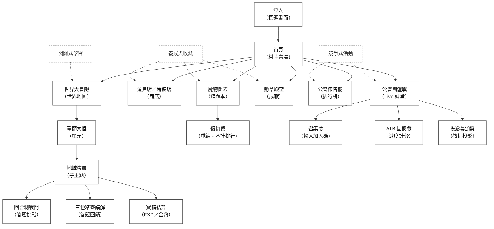
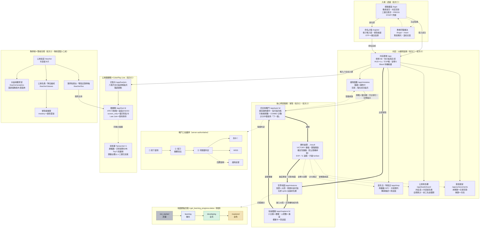
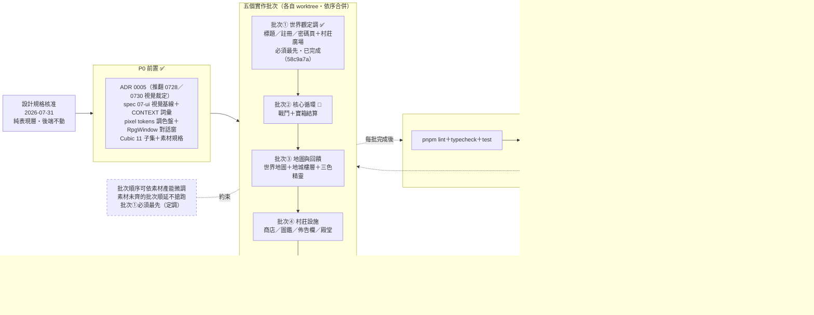
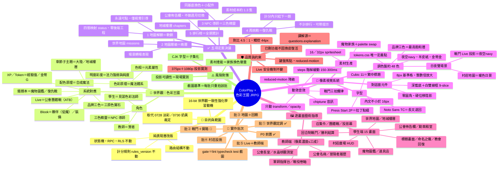

# ColorPlay × 日式 RPG 像素風 — 平台流程圖與心智圖

> 依據 [2026-07-31-jrpg-pixel-restyle-design.md](./2026-07-31-jrpg-pixel-restyle-design.md)（已核准）整理。
> 範圍鐵律：**純表現層改版** — 狀態機、RPC、RLS、ledger、計分規則（`rules_version`）與路由結構一律不動。
> 進度標記：✅ 已完成　🔨 進行中

---

## 圖 1｜平台功能架構圖（樹狀總覽）

---

## 圖 2｜平台整體流程圖（學生端 × Live × 教師端）

**讀圖要點**

- 粗箭頭＝核心學習循環：村莊 → 世界地圖 → 地城樓層 → 戰鬥 → 寶箱結算 → 回地圖。
- 重答一律走魔物圖鑑的「復仇戰」（不計排行、可帶提示、不動 `rules_version`）；計分 session 內只給「下一題」。
- 戰鬥三拍為 server-authoritative：伺服器回應抵達前不得顯示對錯。
- 場景日夜規則：村莊與世界地圖＝暖色日景；戰鬥、Live、投影幕＝夜空 navy。

---

## 圖 3｜實作批次流程圖（P0 → 批次⑤）

---

## 圖 4｜設計規格心智圖（全貌）

