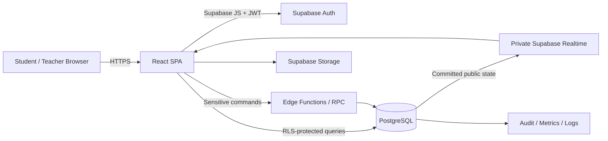
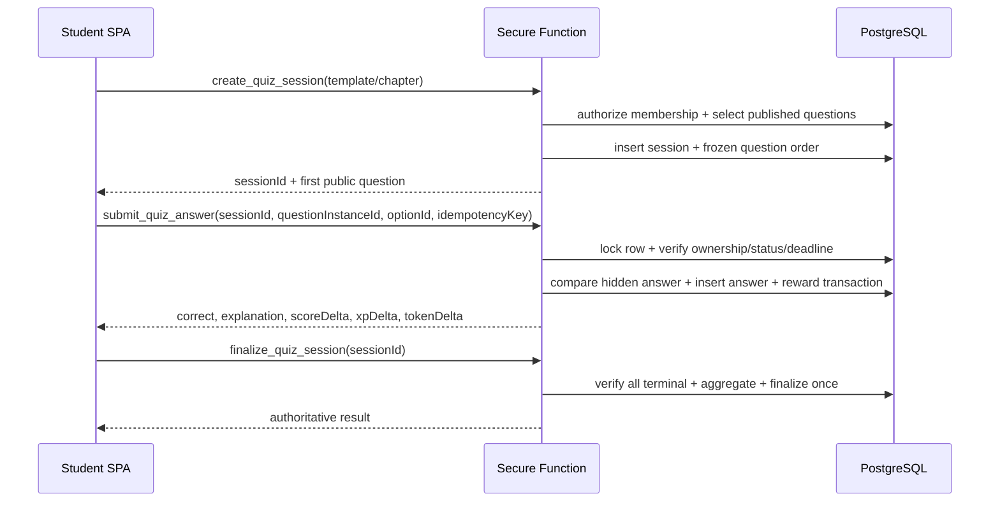

# 系統架構規格

## 1. 架構目標

- 將 UI、遊戲規則、權限與資料持久化清楚分離。
- 瀏覽器可直接讀取被 RLS 保護的非敏感資料，但高風險 mutation 透過受控 RPC／Edge Function。
- 所有關鍵操作可追蹤、可重試、可測試、不可因前端重送而重複發獎。
- 支援本機 Supabase、staging 與 production 三環境。

## 2. 高階架構



### 信任原則

- React SPA：不可信，負責呈現與輸入。
- Supabase Auth JWT：身份憑證，但權限仍由 RLS／後端驗證。
- PostgreSQL + RLS：資料授權主防線。
- Edge Function／security definer function：高風險交易入口，必須最小權限、固定 `search_path`、驗證 caller。
- Supabase Realtime：只傳 committed public projection、Presence 與版本通知；PostgreSQL is the system of record。
- Service role：只存在受控伺服器環境，絕不可進入 Vite `VITE_*` 變數。

## 3. 前端分層

### `src/app`

- Router、Providers、QueryClient、ErrorBoundary、Auth bootstrap。
- 不包含題庫或分數規則。

### `src/features/*`

每個 feature 包含：

```text
api/
components/
hooks/
pages/
schemas/
types.ts
```

- `auth`：登入、session、route guards。
- `learning`：章節、section、review cards。
- `quiz`：session UI、timer presentation、answer mutation、result。
- `remediation`：錯題、補救 session 與 resolution UI。
- `progress`：server-derived review／subtopic／chapter read models。
- `rewards`：XP／Token ledgers、wallet、level display。
- `achievements`：catalog、progress、unlock read models。
- `inventory`：Blook catalog、購買、裝備。
- `classrooms`：classroom、membership、join code。
- `assignments`：lifecycle、targets、authoritative attempts。
- `leaderboard`：班級排名 privacy-safe read model。
- `live`：ColorPlay Live lobby、host state、participant state、recovery。
- `profile`：暱稱、Blook 裝備摘要、個人歷程。
- `teacher`：workspace composition、content、import、analytics、export；不得繞過其他 feature repository/RLS。

### State 規則

- TanStack Query：所有 server state。
- Zustand：quiz 畫面暫態，例如本題選取狀態、動畫、待送出 UI 狀態；不得保存正式 XP／Token。
- URL：可分享與可恢復的 navigation state。
- localStorage：只保存非敏感偏好；Auth token 由 Supabase client 正規機制管理。

## 4. 後端介面分類

### 可直接經 RLS 讀取

- 已發布章節、section、subtopic、review card。
- 使用者自己的 profile、wallet summary、quiz sessions、answers。
- 所屬班級允許公開的 leaderboard view。
- 教師擁有班級的分析 view。

### 必須經 RPC／Edge Function

- `create_quiz_session`
- `submit_quiz_answer`
- `finalize_quiz_session`
- `purchase_blook`
- `equip_blook`（可 RPC 或嚴格 RLS mutation）
- `join_classroom`
- `publish_content_version`
- `commit_question_import`
- `export_research_dataset`
- `create_assignment`／`publish_assignment`／`archive_assignment`
- `create_live_session`／`join_live_session`／`submit_live_answer`
- `start_live_session`／`advance_live_session`／`finalize_live_session`
- `request_question_hint`／remediation commands
- achievement evaluation commands triggered by trusted domain events

原因：這些操作涉及多表交易、隱藏答案、權限提升、重送保護或審計。

## 5. Quiz 資料流



### Public question payload

允許：

- question instance ID
- question text
- ordered options with opaque IDs
- media URL／alt text
- duration seconds
- public subtopic label

禁止：

- correct option ID/index
- explanation before submission
- teacher notes
- internal difficulty calibration if not intended public

## 6. 部署拓撲

### Local

- Vite dev server。
- Supabase CLI local stack。
- deterministic seed users／classes／content。

### Staging

- 與 production 相同 schema 與 migration。
- 專用 Supabase project，使用合成資料。
- 每個 release candidate 執行完整 acceptance。

### Production

- 靜態前端部署於支援 HTTPS、immutable assets、SPA fallback 的平台。
- Supabase production project。
- Production secrets 僅存在部署平台／Supabase secrets。
- staging 與 production project ID、keys、Storage bucket 完全分離。

完整環境 authority、Auth URL、release 與 backup 契約見 `docs/deployment/environment-matrix.md` 與 `docs/deployment/production-readiness.md`。Preview 只指向 rebuilt Staging；`main` 的 Vercel Production 只指向 new clean Production。Database migration 是獨立 protected gate，不隨前端 deployment 盲推。

## 7. 環境變數

前端可有：

```text
VITE_SUPABASE_URL
VITE_SUPABASE_ANON_KEY
```

禁止前端有：

```text
SUPABASE_SERVICE_ROLE_KEY
DATABASE_URL
JWT_SECRET
SMTP_PASSWORD
任何教師共用密碼
```

`.env.example` 只放變數名稱與假值；`.env*` 實際值不得提交。

前端 allowlist 僅有上述兩個名稱。Service role、database password、JWT secret、SMTP credential、monitoring write key 與 backup key 只在 server-side secret store，並依環境分離與輪替。

## 8. 錯誤處理

- 所有後端錯誤回傳 `{ code, message, requestId, retryable }`，domain code 使用 `AUTH`、`PERMISSION`、`VALIDATION`、`CONFLICT`、`RATE_LIMIT`、`QUIZ`、`LIVE`、`ECONOMY`、`IMPORT`、`UNAVAILABLE`。
- 不把 SQL、stack trace、service role 或答案洩漏給前端。
- Mutation 失敗不做 optimistic 正式獎勵；可做純視覺 pending。
- 每個 request／function invocation 產生 correlation ID。
- React query retry：讀取可有限重試；非 idempotent mutation 不盲目自動重送，應使用 idempotency key。
- Read Query 最多重試兩次，使用 exponential backoff + jitter；Auth、permission、validation、not-found 不重試。
- Rate limit 遵守 retry metadata。Mutation 遇 uncertain timeout 時先查 command status，再以原 idempotency key 由使用者重試。

Terminal code handling：

| Code | UI/result | Automatic retry |
| --- | --- | --- |
| `UNAUTHENTICATED` | 清除失效 session、導向 login、保留安全 return intent | No |
| `FORBIDDEN` | 顯示 permission state，不洩漏 target | No |
| `CONFLICT` | 重新讀 authoritative resource/version，再由使用者決定 | No blind retry |
| `EXPIRED` | 顯示 terminal expired state，不恢復 mutation UI | No |
| `RATE_LIMITED` | 顯示 safe retry time | Follow server metadata |
| `INTERNAL_ERROR` | 顯示 request ID 與可恢復入口 | Read only when marked retryable |

## 9. 交易與一致性

以下必須是單一資料庫 transaction：

- 答案寫入 + reward ledger + wallet balance 更新。
- Blook 購買 + token 扣除 + ownership 建立。
- Import commit。
- Quiz finalize + leaderboard read model 更新（或由一致的 view 推導）。
- Live answer/score update；Live finalize + ranks + reward ledgers + achievement/assignment/progress events + audit。

錢包餘額建議由 immutable ledger 聚合或由 transaction 維持的 cache 欄位。任何方式都要提供 reconciliation query，驗證 ledger 合計與餘額一致。

## 10. 可觀測性

每個敏感操作記錄：

- actor user ID
- action
- target type／ID
- result
- request ID
- timestamp
-必要的安全 metadata

不得在 log 中記錄密碼、access token、完整 Email、答案內容或未匿名化研究資料。

## 11. ColorPlay Live interface boundary

Live state machine：

```text
draft -> lobby -> question_open -> question_feedback
       -> question_open ... -> completed
draft/lobby/question states -> cancelled
```

- Private topic 是 `live-session:<sessionId>`；`realtime.messages` RLS 只允許 host 與 active participants 加入核准 channel。
- Student 可接收 committed public state 與發佈 Presence，不可廣播 host transition。Outsider 不可 subscribe。
- Realtime payload 只含 `state_version`、public question/options、server deadline、aggregate counts、phase、result-ready；不含 pre-close correct answer、individual answer、Email、secret 或 reward mutation。
- Transaction commit 後才 broadcast。Refresh/reconnect 一律呼叫 `get_live_session_state` 並按 `state_version` reconcile。
- `submit_live_answer` 驗 Auth/membership/open question/option/server deadline，lock row，以 idempotency 寫一筆 authoritative answer，再發 safe aggregate。
- `finalize_live_session` lock session、驗 host、計 score/rank/reward/achievement/assignment/progress/audit，同一 transaction 完成；任何失敗全部 rollback。

## 12. Query／RPC／Edge Function ownership

| Interface | Use | Boundary |
| --- | --- | --- |
| TanStack Query + RLS/PostgREST | Published content、own state、privacy-safe views | 無多表敏感 mutation、無 hidden answer |
| Transactional RPC | Quiz/economy/classroom/assignment/Live command | `auth.uid()`、ownership、lock、unique/idempotency、fixed `search_path` |
| Edge Function | XLSX parsing、large export、server-only integration/rate-limit work | 驗 JWT/role/scope；server secrets 不回 browser |
| Private Realtime | Committed Live state notification/Presence | PostgreSQL system of record；RLS on `realtime.messages` |

`external_activities` 只保存 teacher-owned optional Kahoot URL、classroom/chapter scope、availability/status。它不依賴 official API，不同步外部 report，不把外部結果當 ColorPlay score。

## 13. Teacher analytics read models

Canonical interfaces：`teacher_classroom_summary`、`teacher_question_analysis`、`teacher_subtopic_mastery`、`teacher_assignment_summary`、`teacher_live_session_report`。每個結果由 fact tables 重現、以 owning teacher/classroom authorize、明確定義 numerator/denominator；empty denominator 回 `null` 供 UI 顯示 `—`，不產生 random/client metric。

## 14. Audit event contract

Audit role/membership change、content publish/import、reward/shop mutation、assignment lifecycle、Live host command/finalize、research export。Append-only event 最少記 UTC time、actor、action、target、request/correlation ID、result、rules/content version、safe metadata；不記 Email、answer payload、token、credential 或 raw research row。
